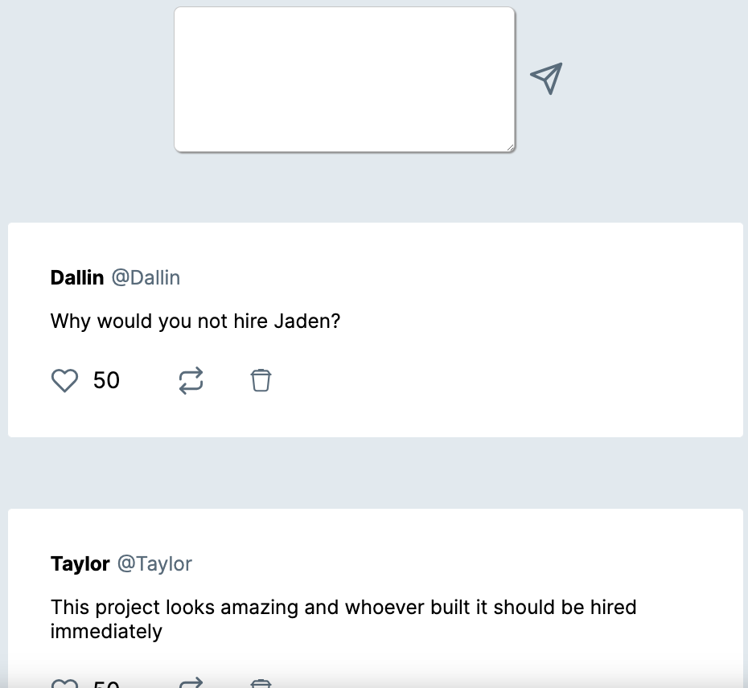

## Twitter post project

To run locally, clone repo, run `npm install` and then run `npm run dev` and navigate to`http://localhost:3000/twitter`.

This app can create posts much like Twitter. It has the functionality to like, repost and delete any posts.  It looks like some people on there have some really smart things to say.

